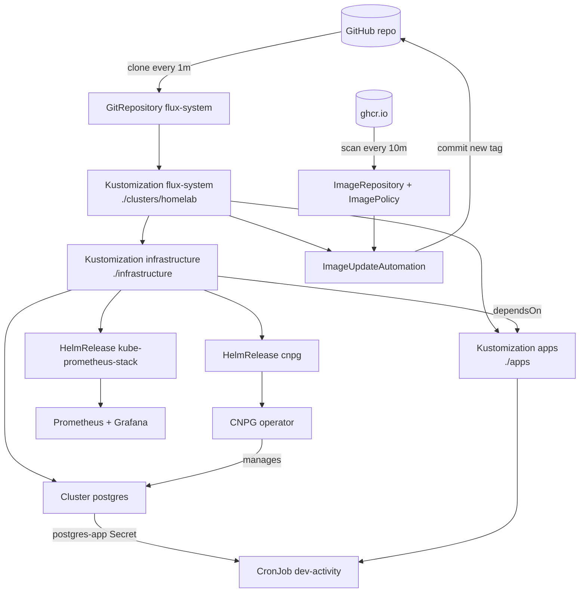

# Homelab

Bare-metal Kubernetes homelab — k3s cluster on dedicated hardware, running self-written Go microservices with PostgreSQL.

Full cloud-native pipeline:

> Go code → multi-stage Docker build → GitHub Actions CI → GHCR → GitOps delivery via FluxCD → Prometheus metrics collection → Grafana observability dashboards

Infrastructure managed declaratively: all manifests version-controlled in Git, zero manual deployments. Next on the roadmap: Traefik Ingress routing and secrets encrypted with SOPS + age.

## Repository structure

```
homelab
├── clusters/homelab/              # Flux entry point: what the cluster syncs
│   ├── flux-system/               # Flux itself (generated by bootstrap)
│   │   ├── gotk-components.yaml   #   Flux controllers, CRDs, RBAC
│   │   ├── gotk-sync.yaml         #   GitRepository + root Kustomization
│   │   └── kustomization.yaml     #   ties the two files above together
│   ├── infrastructure.yaml        # Flux Kustomization → ./infrastructure
│   ├── apps.yaml                  # Flux Kustomization → ./apps (after infra)
│   └── image-automation.yaml      # commits new image tags back to Git
├── infrastructure/                # platform layer: operators, databases
│   ├── cnpg/                      # CloudNativePG operator (via Helm)
│   │   ├── namespace.yaml         #   cnpg-system namespace
│   │   ├── repository.yaml        #   HelmRepository: CNPG chart source
│   │   └── release.yaml           #   HelmRelease: the operator itself
│   ├── monitoring/                # kube-prometheus-stack (via Helm)
│   │   ├── namespace.yaml         #   monitoring namespace
│   │   ├── repository.yaml        #   HelmRepository: prometheus-community
│   │   └── release.yaml           #   HelmRelease: Prometheus + Grafana + exporters
│   └── postgres/
│       └── cluster.yaml           # CNPG Cluster: the PostgreSQL instance
├── apps/                          # microservices layer
│   └── dev-activity/
│       ├── cronjob.yaml           # hourly GitHub-activity collector
│       └── image-policy.yaml      # ImageRepository + ImagePolicy for CI tags
├── .github/workflows/
│   └── validate.yaml              # kubeconform schema check on every push/PR
├── cheatsheets/                   # command references (k3s, Flux, CNPG, ...)
└── journal/                       # dated engineering notes
```

## How it fits together



Flux pulls the repo, applies `clusters/homelab/`, which in turn creates two more Kustomizations: `infrastructure` first (operators, database), then `apps` (workloads that depend on them). CI pushes a new image to GHCR → image automation notices it, rewrites the tag in `apps/` and commits — the same pull loop then deploys it. The cluster never receives a manual `kubectl apply`.

## Manifests

### `clusters/homelab/` — Flux entry point

| Manifest | Kind | Purpose |
|---|---|---|
| `flux-system/gotk-components.yaml` | Deployments, CRDs, RBAC | Flux controllers themselves (source, kustomize, helm, image-reflector, image-automation). Generated by `flux bootstrap`, not hand-edited. |
| `flux-system/gotk-sync.yaml` | GitRepository, Kustomization | The self-referencing loop: clone this repo over SSH every minute, apply `./clusters/homelab`. Everything else grows from here. |
| `flux-system/kustomization.yaml` | kustomize config | Plain kustomize file listing the two generated manifests above. |
| `infrastructure.yaml` | Flux Kustomization | Applies `./infrastructure`. `prune: true` — delete a file from Git and the resource is removed from the cluster. Hourly interval is only a drift check; commits apply immediately. |
| `apps.yaml` | Flux Kustomization | Applies `./apps`, with `dependsOn: infrastructure` — apps consume what infra provides (the `postgres-app` Secret), so infra must be ready first. |
| `image-automation.yaml` | ImageUpdateAutomation | Closes the CD loop: rewrites image tags in `./apps` (lines marked with `$imagepolicy`) and pushes a commit to `main` over the write-enabled deploy key. |

### `infrastructure/` — platform layer

| Manifest | Kind | Purpose |
|---|---|---|
| `cnpg/namespace.yaml` | Namespace | `cnpg-system`. Declared so a from-scratch bootstrap recreates it (it predates GitOps). |
| `cnpg/repository.yaml` | HelmRepository | Chart source: the CloudNativePG project's Helm repo, index refreshed hourly. |
| `cnpg/release.yaml` | HelmRelease | Installs the CNPG operator (chart pinned to `0.29.0`). Upgrades happen by bumping the version in Git. CRDs carry `resource-policy: keep`, so uninstalling never deletes databases. |
| `monitoring/namespace.yaml` | Namespace | `monitoring` — home of the observability stack. |
| `monitoring/repository.yaml` | HelmRepository | Chart source: the prometheus-community Helm repo. |
| `monitoring/release.yaml` | HelmRelease | kube-prometheus-stack (pinned): Prometheus Operator, Prometheus (10Gi PVC), Grafana (2Gi PVC), kube-state-metrics, node-exporter. Values tuned for k3s: control-plane component scraping disabled (single binary, kine instead of etcd); `remediation.retries` so transient failures self-heal. |
| `postgres/cluster.yaml` | Cluster (CNPG CRD) | The actual PostgreSQL instance: single node, 5Gi local-path storage, memory-limited for old-laptop hardware. The operator generates the `app` database, user, and connection string in the `postgres-app` Secret. |

### `apps/` — microservices

Go microservices; manifests live here, source code in separate repos: [dev-activity](https://github.com/AshBuk/dev-activity).

| Manifest | Kind | Purpose |
|---|---|---|
| `dev-activity/cronjob.yaml` | CronJob | Hourly collector of my GitHub activity into Postgres (the events API keeps only ~90 days, so polling builds the long-term record). Distroless image, non-root, read-only rootfs, all capabilities dropped. The image tag line carries the `$imagepolicy` marker that image automation rewrites. |
| `dev-activity/image-policy.yaml` | ImageRepository, ImagePolicy | Scans `ghcr.io/ashbuk/dev-activity` every 10 minutes; picks the newest CI tag by extracting the unix timestamp from `main-<ts>-<sha>` (raw SHA tags have no natural ordering — that's why CI produces the timestamped tag). |

### `.github/workflows/`

| Manifest | Purpose |
|---|---|
| `validate.yaml` | Runs kubeconform on every push/PR: validates all manifests against upstream schemas plus the community CRDs-catalog (Flux, CNPG), so typos are caught before Flux ever sees them. |
